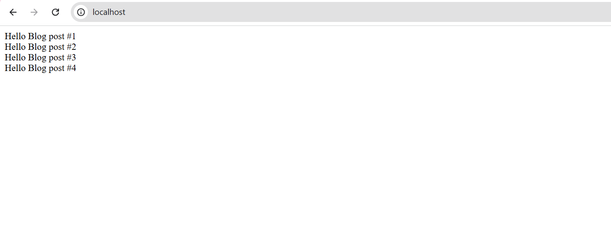
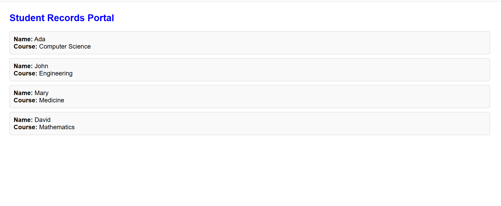
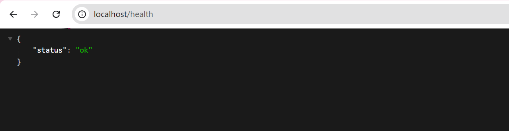
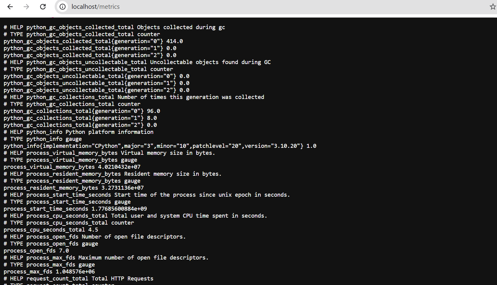

# Capstone Project

## Project Goal:
We are building a secure internal web application (student/admin portal) using Docker, Nginx, HTTPS, CI/CD, and Kubernetes. It will run locally but be designed like a real production system.

1. Application (Frontend + Backend + DB)

- Frontend: HTML/CSS (or React if we want)
- Backend: Flask
- Database: MySQL
- Features:admin dashboard or student Portal.
- Add /health endpoint

2. Nginx Reverse Proxy + TLS

- Configure Nginx as reverse proxy
- Route traffic to app container
- Enable HTTPS using self-signed certificate
-  SSL/TLS 

3. Docker Setup

- Write Dockerfile for app
- Create Docker Compose to connect:
  - nginx
  - app
  - mysql
- Ensure containers communicate properly

4. Logging & Monitoring

- Capture:
  - Nginx access logs
  - App logs
- Show evidence (screenshots/log output)
- Add basic metrics or health checks.

5. CI/CD Pipeline

- Use GitHub Actions
- Build Docker image
- Push image to Docker Hub (or GHCR)

6. Kubernetes (Minikube)

- Deploy app using:
  - Pods / Deployments
  - Services
  - Ingress (acts like Nginx in K8s)

7. AWS Architecture (Design Only)


## Project Overview

This project builds a **secure internal web application** (Student Records Portal) running behind an Nginx reverse proxy with HTTPS, containerised with Docker, monitored with Prometheus metrics, and deployed to Kubernetes. It is designed to mirror a real production system architecture.

The project is based on the [`docker/awesome-compose` nginx-flask-mysql sample](https://github.com/docker/awesome-compose) and rebranded into a fully functional Student Records Portal.

---

## Tech Stack

| Layer | Technology |
|---|---|
| Frontend | HTML/CSS (served via Flask templates) |
| Backend | Python · Flask |
| Database | MySQL |
| Reverse Proxy | Nginx |
| TLS | Self-signed certificate (HTTPS local) |
| Containerisation | Docker · Docker Compose |
| Monitoring | Prometheus client (`/metrics`) · `/health` endpoint |
| CI/CD | GitHub Actions |
| Orchestration | Kubernetes (Minikube) |
| Cloud Design | AWS (EC2 · ALB · S3 · IAM · Security Groups) |

---

## What I Modified

### Before — Original Sample App

The starting point was the `docker/awesome-compose` nginx-flask-mysql sample. It was a plain Flask hello-world app with no database interaction, no styling, and no monitoring.



---

### After — Student Records Portal

The app was rebranded and extended into a **Student Records Portal** with the following changes:

- Connected Flask to MySQL and seeds a `students` table on startup
- Homepage (`/`) displays student records (name + course) in styled cards
- Password read securely from a Docker secret at `/run/secrets/db-password`
- Added `/health` endpoint returning `{"status": "ok"}`
- Added `/metrics` endpoint with Prometheus request counter



---

**Key changes made to the app:**

- Connected to MySQL and creates a `students` table on startup with seeded records (Ada, John, Mary, David)
- Homepage (`/`) displays student name and course in styled cards
- Reads the database password securely from a Docker secret file at `/run/secrets/db-password`
- Added a **`/health`** endpoint returning `{"status": "ok"}` with HTTP 200
- Added a **`/metrics`** endpoint exposing Prometheus-compatible metrics (total HTTP request count)
- Integrated `prometheus_client` with a `REQUEST_COUNT` counter that increments on every request

```python
# Key endpoints added
@app.route('/health')
def health():
    return jsonify({"status": "ok"}), 200

@app.route('/metrics')
def metrics():
    return generate_latest(), 200, {'Content-Type': 'text/plain'}
```
## Health & Metrics Endpoints

### /health

Returns a simple JSON health check — confirms the app is running:



### /metrics

Exposes Prometheus-compatible metrics including the `request_count` counter:




## Project Structure

```
.
├── backend/
│   ├── hello.py              # Flask app — Student Records Portal
│   ├── requirements.txt      # Python dependencies
│   └── Dockerfile            # App dockerfile
├── proxy/
│   ├── conf            # Nginx reverse proxy config
│   └── Dockerfile/                # dockerfile for Nginx
├── docker-compose.yml   #docker compose
├── db        #database folder
|    ├── password.txt        
├── screenshots/              # Evidence screenshots
│   ├── app-home.png
│   ├── health-endpoint.png
│   ├── metrics-endpoint.png
│   ├── app-before.png
│   
└── README.md
```


---

## How to Run Locally

### Prerequisites
- Docker Desktop installed and running
- `docker compose` available

### Steps

```bash
# 1. Clone the repository
git clone <your-repo-url>
cd <project-folder>

# 2. Build and start all containers
docker compose up --build

# 3. Access the app
# HTTP  → redirected to HTTPS
# HTTPS → https://localhost (accept the self-signed cert warning)

# 4. Test endpoints
curl -k https://localhost/health
curl -k https://localhost/metrics

# 5. View proxy logs
docker compose logs proxy

# 6. Stop everything
docker compose down
```


## References

- [docker/awesome-compose nginx-flask-mysql](https://github.com/docker/awesome-compose/tree/master/nginx-flask-mysql)
- [gh640/docker-compose-depends_on-nginx-certs-sample](https://github.com/gh640/docker-compose-depends_on-nginx-certs-sample)
- [Prometheus Python Client](https://github.com/prometheus/client_python)
- [Flask Documentation](https://flask.palletsprojects.com/)